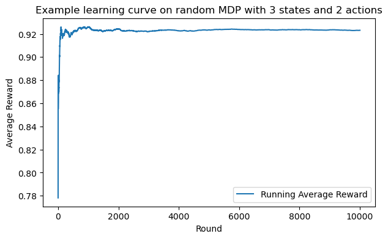

# CSCI567 Spring 2025 - Q-Learning Coding Assignment

## Overview

This assignment involves implementing a simple Q-learning agent with experience replay. Your task is to complete the implementation of the `ReplayBuffer` class and the `QLearningAgent` class. The provided code includes utility functions and data structures to help you with the implementation.

## Instructions
0. Read through `utils.py` and `finite_mdp.py`.
1. Complete the implementation of the `ReplayBuffer` class in `replay_buffer.py`.
2. Complete the implementation of the `QLearningAgent` class in `q_learning.py`.
    - Warning: Do not set random seeds anywhere in your implementation.
3. Test your implementation thoroughly on your local machine.
    - You may use `playground.ipynb` to test your agent. 
    - A recommended approach to use Jupyter notebook is via (this vscode extension)[https://code.visualstudio.com/docs/datascience/jupyter-notebooks].
    - Feel free to modify anything in the notebook (it will not be graded).
4. Submit through Vocareum.

## Files
### `utils.py`
Contains utility functions and data structures for setting seeds, and handling transitions and batches. A utility function for generating a random MDP is also provided and can be used for testing.

### `finite_mdp.py`
Defines the `FiniteMDP` class representing a Markov Decision Process with finite state and action spaces (also called tabular MDP).

### `replay_buffer.py`
(TODO) Implements the `ReplayBuffer` class for storing and sampling transitions.

### `q_learning.py`
(TODO) Implements the `QLearningAgent` class for a Q-learning agent with experience replay.

## Some recommendations
- Try to vectorize your code whenever possible.
- As in `playground.ipynb`, you may use the `generate_random_mdp` function from `utils.py` to create random MDPs for testing your agent. Below is an example learning curve:

